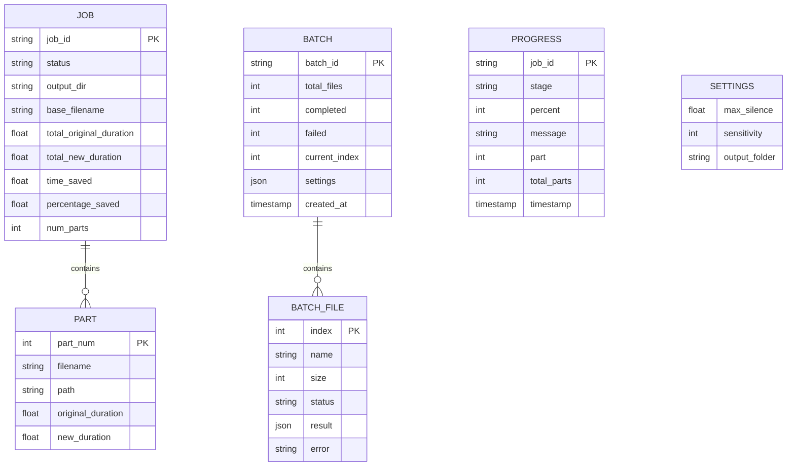
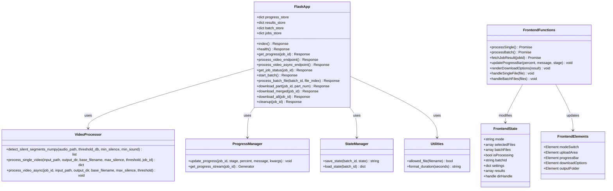
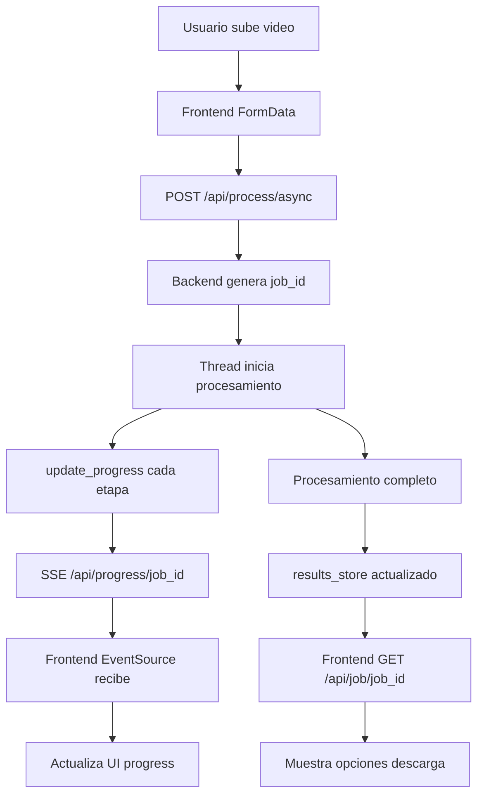
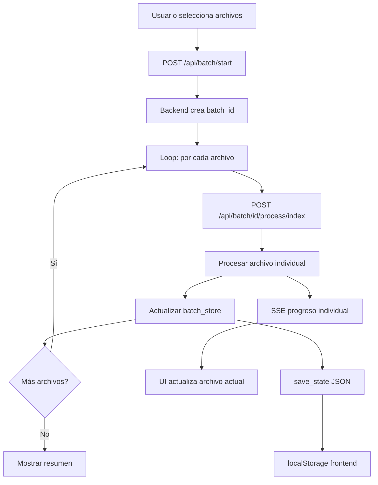

# 03-B - Modelado de Datos

## 1. Diagrama Entidad-Relación (DER)

> Nota: Esta aplicación no usa base de datos tradicional. El DER representa las estructuras de datos en memoria y archivos JSON.



---

## 2. Diagrama de Clases



---

## 3. Estructuras de Datos Detalladas

### 3.1 Progress Store (Backend)

```python
progress_store = {
    "job_id_uuid": {
        "stage": "processing",      # uploading|loading|extracting|analyzing|cutting|rendering|complete|error
        "percent": 45,              # 0-100
        "message": "⚙️ Procesando parte 2/3",
        "timestamp": 1703548800.123,
        "part": 2,                  # Opcional: parte actual
        "total_parts": 3            # Opcional: total de partes
    }
}
```

### 3.2 Results Store (Backend)

```python
results_store = {
    "job_id_uuid": {
        "job_id": "job_id_uuid",
        "output_dir": "C:\\Temp\\output_uuid",
        "base_filename": "video_editado",
        "num_parts": 2,
        "parts": [
            {
                "filename": "video_editado_parte1.mp4",
                "path": "C:\\Temp\\output_uuid\\video_editado_parte1.mp4",
                "part_num": 1,
                "original_duration": 1800.5,
                "new_duration": 1520.3
            },
            {
                "filename": "video_editado_parte2.mp4",
                "path": "C:\\Temp\\output_uuid\\video_editado_parte2.mp4",
                "part_num": 2,
                "original_duration": 1750.2,
                "new_duration": 1480.8
            }
        ],
        "total_original_duration": 3550.7,
        "total_new_duration": 3001.1,
        "total_time_saved": 549.6,
        "percentage_saved": 15.5
    }
}
```

### 3.3 Batch Store (Backend)

```python
batch_store = {
    "batch_id_uuid": {
        "batch_id": "batch_id_uuid",
        "total_files": 5,
        "completed": 2,
        "failed": 0,
        "current_index": 3,
        "files": [
            {"name": "video1.mp4", "size": 104857600, "status": "completed", "result": {...}},
            {"name": "video2.mp4", "size": 209715200, "status": "completed", "result": {...}},
            {"name": "video3.mp4", "size": 157286400, "status": "processing", "result": None},
            {"name": "video4.mp4", "size": 262144000, "status": "pending", "result": None},
            {"name": "video5.mp4", "size": 188743680, "status": "pending", "result": None}
        ],
        "settings": {
            "max_silence": 3.0,
            "sensitivity": 5
        },
        "created_at": 1703548800.0
    }
}
```

### 3.4 Jobs Store (Backend)

```python
jobs_store = {
    "job_id_uuid": {
        "status": "processing",  # processing|completed|error
        "save_to_custom": True,
        "output_folder": "C:\\Videos\\Editados",
        "result": {...}          # Solo cuando status=completed
    }
}
```

### 3.5 Frontend State (JavaScript)

```javascript
const state = {
    mode: 'single',           // 'single' | 'batch'
    selectedFiles: [],        // Array<File>
    batchFiles: [],           // Array<{file, name, size, selected, status}>
    isProcessing: false,
    batchId: null,
    settings: {
        maxSilence: 3.0,      // 0.5 - 10.0
        sensitivity: 5         // 1 - 10
    },
    results: [],              // Array<ResultObject>
    dirHandle: null           // FileSystemDirectoryHandle (optional)
};
```

### 3.6 LocalStorage Schema (Frontend)

```javascript
// Key: 'silencecutter_state'
{
    "batchId": "batch_id_uuid",
    "files": [
        {"name": "video1.mp4", "size": 104857600, "status": "completed"},
        {"name": "video2.mp4", "size": 209715200, "status": "pending"}
    ],
    "settings": {
        "maxSilence": 3.0,
        "sensitivity": 5
    },
    "results": [...]
}
```

---

## 4. Flujo de Datos

### 4.1 Flujo de Procesamiento Single



### 4.2 Flujo de Procesamiento Batch



---

## 5. Persistencia

### 5.1 Archivos JSON (Server-side)

| Archivo | Ubicación | Contenido |
|---------|-----------|-----------|
| `batch_state_{id}.json` | `%TEMP%/` | Estado del batch para resume |

### 5.2 LocalStorage (Client-side)

| Key | Contenido | TTL |
|-----|-----------|-----|
| `silencecutter_state` | Estado del batch + resultados | Hasta dismiss |

### 5.3 Archivos Temporales

| Tipo | Ubicación | Limpieza |
|------|-----------|----------|
| Input video | `%TEMP%/input_{uuid}_{filename}` | Automática post-proceso |
| Output videos | `%TEMP%/output_{uuid}/` | Manual via `/api/cleanup` |
| Audio WAV temporal | `%TEMP%/{uuid}.wav` | Automática post-análisis |

---

## Historial de Cambios

| Fecha | Cambio |
|-------|--------|
| 2025-12-26 | Documento inicial - Ingeniería inversa |
