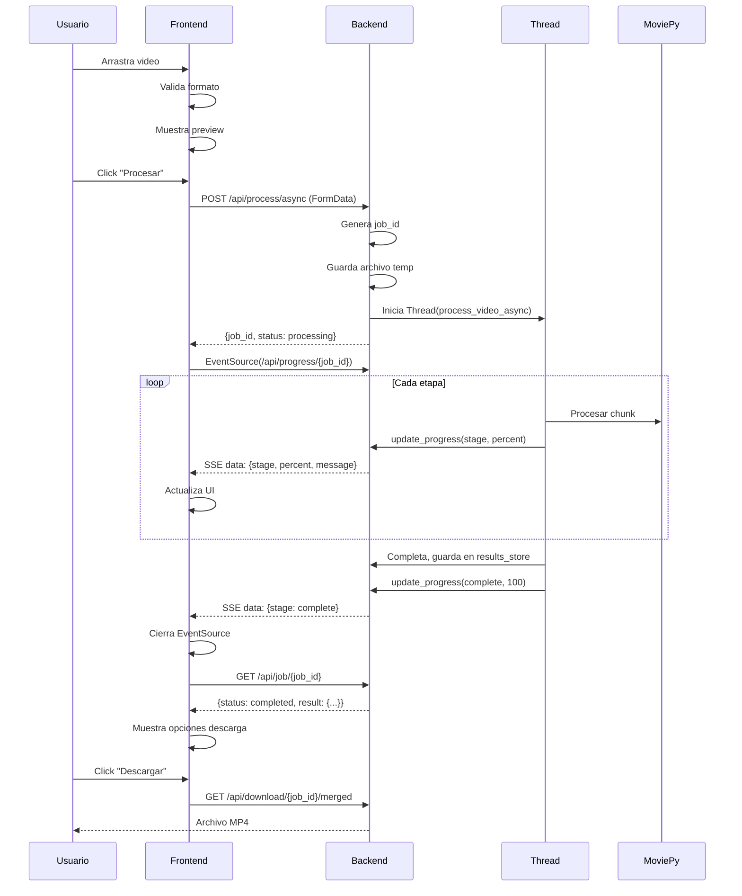
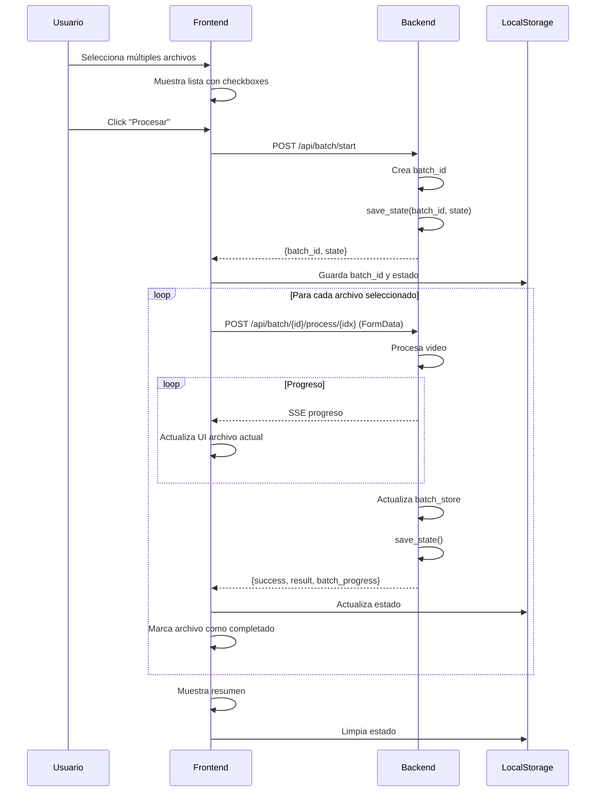
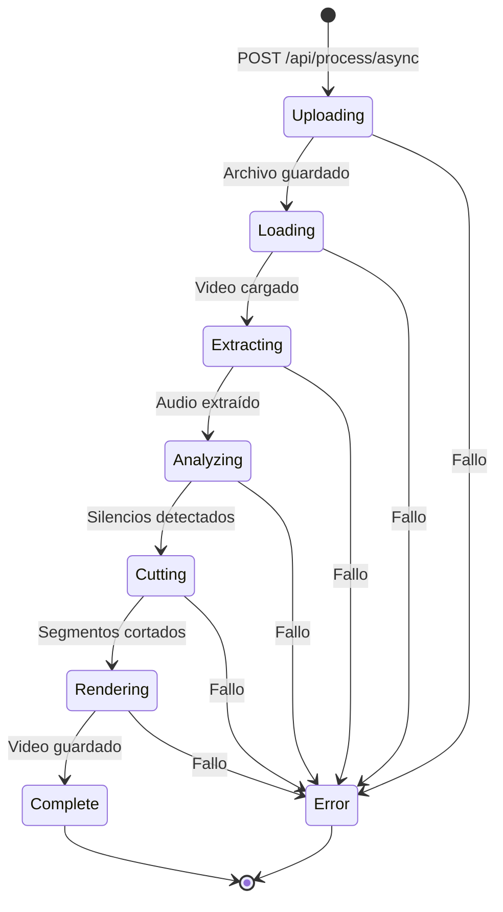
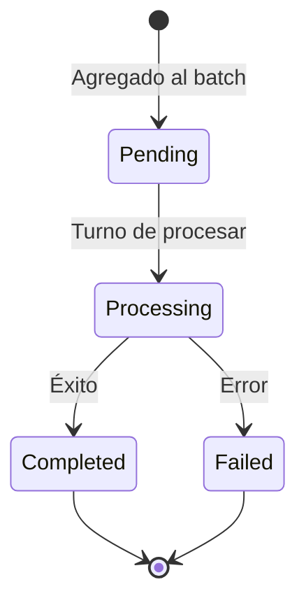
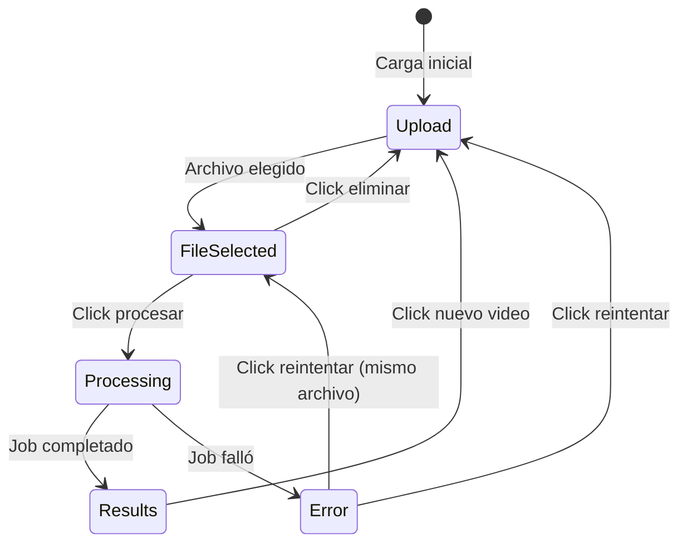

# 03-C - API y Dinámica del Sistema

## 1. Documentación de API REST

### 1.1 Resumen de Endpoints

| Método | Endpoint | Descripción | Auth |
|--------|----------|-------------|------|
| GET | `/` | Página principal | No |
| GET | `/api/health` | Estado del servidor | No |
| GET | `/api/progress/<job_id>` | Stream SSE de progreso | No |
| POST | `/api/process` | Procesar video (sync) | No |
| POST | `/api/process/async` | Procesar video (async) | No |
| GET | `/api/job/<job_id>` | Estado de job async | No |
| POST | `/api/batch/start` | Iniciar batch | No |
| POST | `/api/batch/<id>/process/<idx>` | Procesar archivo de batch | No |
| GET | `/api/batch/<id>/state` | Estado del batch | No |
| GET | `/api/batch/<id>/resume` | Info para resume | No |
| GET | `/api/download/<id>/part/<n>` | Descargar parte | No |
| GET | `/api/download/<id>/merged` | Descargar todo junto | No |
| GET | `/api/download/<id>/all` | Descargar ZIP | No |
| DELETE | `/api/cleanup/<job_id>` | Limpiar archivos | No |

---

### 1.2 Detalle de Endpoints

#### GET `/api/health`

**Propósito**: Verificar que el servidor está funcionando.

**Request**: Ninguno

**Response**:
```json
{
    "status": "ok"
}
```

---

#### POST `/api/process/async`

**Propósito**: Iniciar procesamiento asíncrono de video.

**Request**:
```
Content-Type: multipart/form-data

video: [archivo binario]
max_silence: 3.0
sensitivity: 5
output_folder: "C:\Videos\Editados" (opcional)
```

**Response (200)**:
```json
{
    "success": true,
    "job_id": "7fb8f88b-9cba-491d-9f5d-89c1dbfae16c",
    "status": "processing",
    "output_folder": "C:\\Videos\\Editados"
}
```

**Response (400)**:
```json
{
    "error": "No se envió archivo"
}
```

---

#### GET `/api/progress/<job_id>`

**Propósito**: Stream SSE con actualizaciones de progreso.

**Headers Response**:
```
Content-Type: text/event-stream
Cache-Control: no-cache
X-Accel-Buffering: no
```

**Event Data**:
```json
{
    "stage": "processing",
    "percent": 45,
    "message": "⚙️ Procesando parte 2/3",
    "timestamp": 1703548800.123,
    "part": 2,
    "total_parts": 3
}
```

**Stages posibles**:
| Stage | Descripción |
|-------|-------------|
| `uploading` | Recibiendo archivo |
| `loading` | Cargando video en memoria |
| `extracting` | Extrayendo audio |
| `analyzing` | Analizando silencios |
| `cutting` | Recortando segmentos |
| `rendering` | Renderizando salida |
| `complete` | Finalizado |
| `error` | Error en proceso |

---

#### GET `/api/job/<job_id>`

**Propósito**: Obtener estado actual de un job.

**Response (processing)**:
```json
{
    "status": "processing",
    "progress": {
        "stage": "rendering",
        "percent": 85,
        "message": "🎬 Renderizando..."
    }
}
```

**Response (completed)**:
```json
{
    "status": "completed",
    "result": {
        "job_id": "...",
        "num_parts": 2,
        "parts": [...],
        "total_original_duration": 3600.5,
        "total_new_duration": 3000.2,
        "total_time_saved": 600.3,
        "percentage_saved": 16.7
    }
}
```

**Response (error)**:
```json
{
    "status": "error",
    "error": "FFmpeg no encontrado"
}
```

---

#### POST `/api/batch/start`

**Propósito**: Crear un nuevo batch de procesamiento.

**Request**:
```json
{
    "files": [
        {"name": "video1.mp4", "size": 104857600},
        {"name": "video2.mp4", "size": 209715200}
    ],
    "max_silence": 3.0,
    "sensitivity": 5
}
```

**Response**:
```json
{
    "batch_id": "abc123-...",
    "state": {
        "batch_id": "abc123-...",
        "total_files": 2,
        "completed": 0,
        "failed": 0,
        "current_index": 0,
        "files": [...],
        "settings": {...}
    }
}
```

---

#### GET `/api/download/<job_id>/merged`

**Propósito**: Descargar video completo (une partes si hay múltiples).

**Response**: Archivo binario MP4

**Headers**:
```
Content-Disposition: attachment; filename="video_editado_completo.mp4"
Content-Type: video/mp4
```

---

#### GET `/api/download/<job_id>/all`

**Propósito**: Descargar todas las partes como ZIP.

**Response**: Archivo binario ZIP

**Headers**:
```
Content-Disposition: attachment; filename="video_editado.zip"
Content-Type: application/zip
```

---

## 2. Diagrama de Secuencia

### 2.1 Procesamiento Single Video



### 2.2 Procesamiento Batch



---

## 3. Máquina de Estados

### 3.1 Estados de Job



### 3.2 Estados de Archivo en Batch



### 3.3 Estados de UI (Frontend)



---

## 4. Manejo de Errores

### 4.1 Errores HTTP

| Código | Causa | Mensaje |
|--------|-------|---------|
| 400 | Archivo no enviado | "No se envió archivo" |
| 400 | Formato inválido | "Archivo no válido" |
| 400 | Parámetros inválidos | "Parámetros inválidos" |
| 400 | Carpeta no creada | "No se puede crear la carpeta: {error}" |
| 404 | Job no encontrado | "Job no encontrado" |
| 404 | Batch no encontrado | "Batch no encontrado" |
| 404 | Parte no encontrada | "Parte no encontrada" |
| 500 | Error de procesamiento | "{mensaje de excepción}" |

### 4.2 Errores en Frontend

```javascript
function showError(message) {
    if (elements.errorMessage) elements.errorMessage.textContent = message;
    showSection('errorSection');
}
```

---

## 5. Códigos de Estado de Negocio

### 5.1 Job Status

| Status | Significado |
|--------|-------------|
| `processing` | En proceso |
| `completed` | Finalizado con éxito |
| `error` | Falló |

### 5.2 File Status (Batch)

| Status | Significado |
|--------|-------------|
| `pending` | Esperando turno |
| `processing` | Procesando actualmente |
| `completed` | Completado |
| `failed` | Falló |

---

## Historial de Cambios

| Fecha | Cambio |
|-------|--------|
| 2025-12-26 | Documento inicial - Ingeniería inversa |
